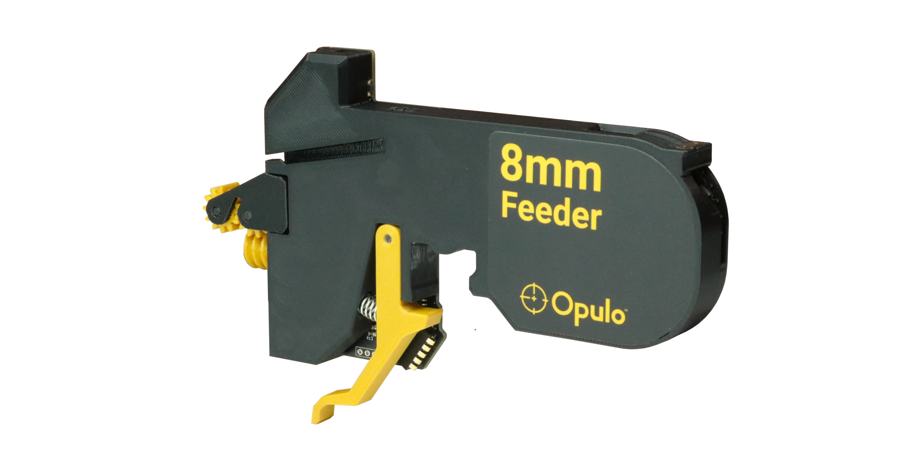
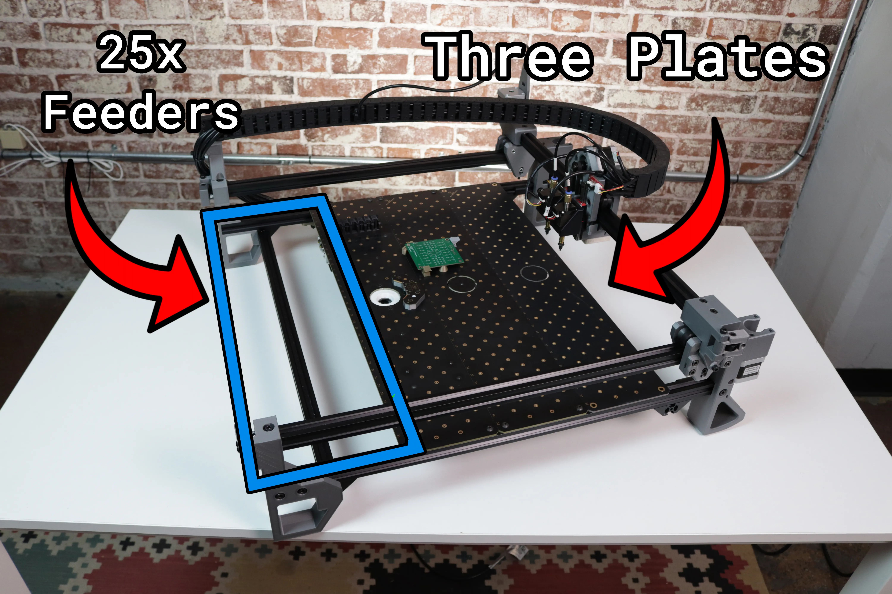
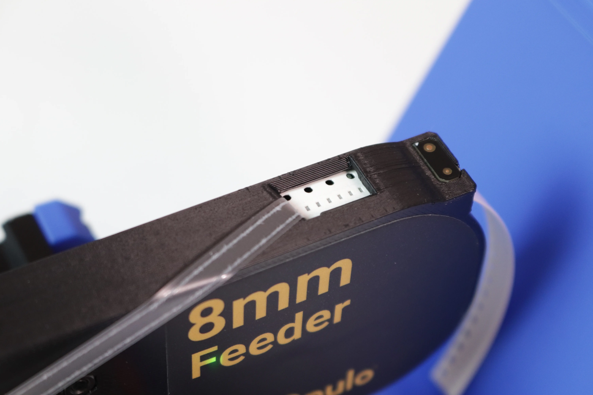
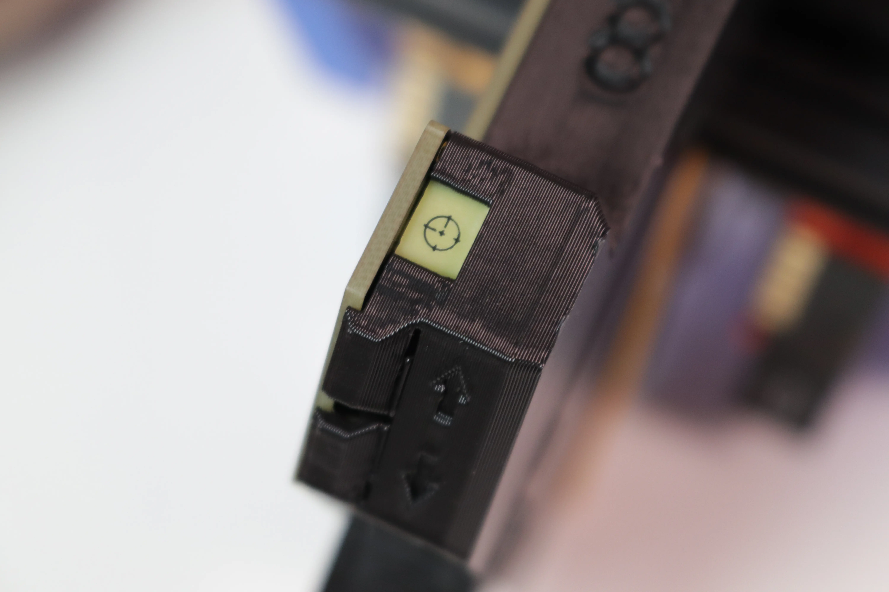
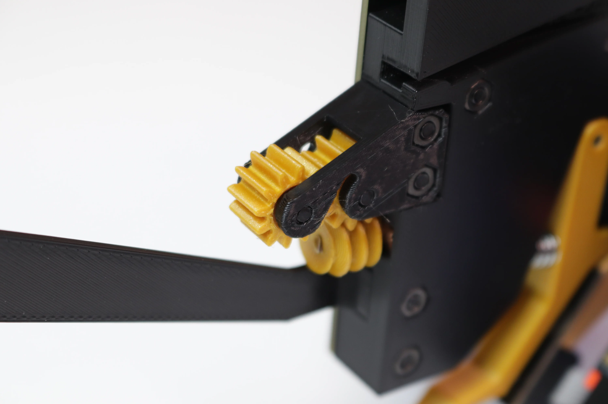
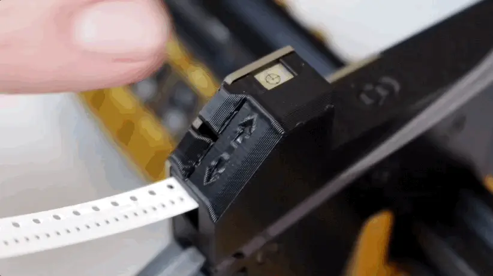
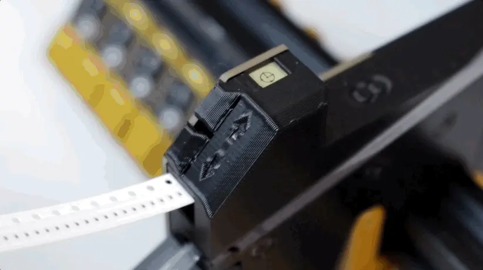
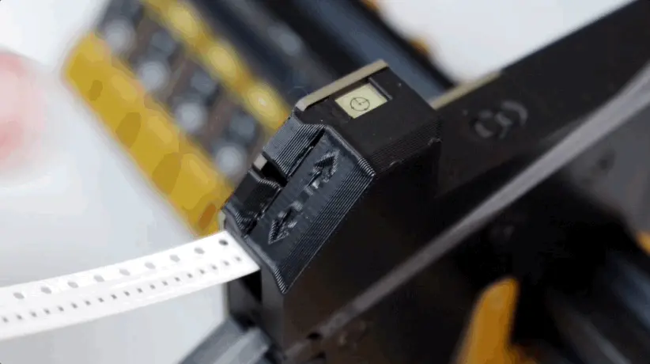
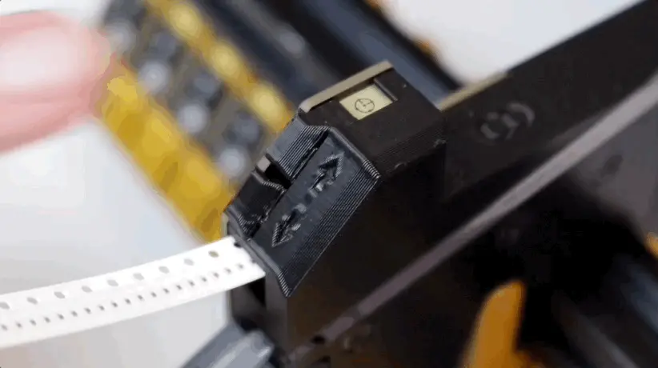
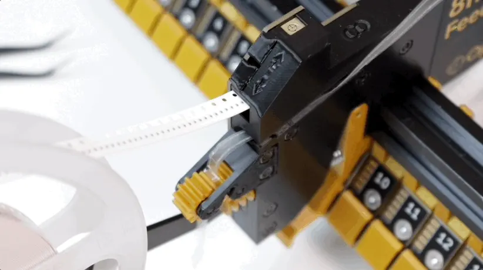

# Overview

This is the LumenPnP Feeder:

The LumenPnP Feeder is an open source SMT component tape feeder that can reliably feed components as small as 0402. It is designed to work with a LumenPnP Pick and Place Machine, but can mount onto any 20mm X 20mm v-slot extrusion. The source can be found [here](https://github.com/opulo-inc/feeder).

The feeder uses the open source [Photon feeder controller firmware](https://github.com/photonfirmware/photon), and talks the Photon protocol over RS-485 to any Marlin host with RS-485 support.

You can fit up to 50x 8mm or 12mm Feeders on the front and back rail of your LumenPnP when using two staging plates.

If you'd like to add a third staging plate, you can fit 25x 8mm or 12mm Feeders on the front rail of your LumenPnP.

## Parts of the Feeder

=== "Pick Window"
    

=== "Buttons"
    

=== "Status Light"
    

=== "Peel Gears"
    

=== "Release Lever"
    

## Feeder Buttons

=== "Feeding"
    Tapping the forward button will make the feeder feed forward 2mm. Tapping the backward button makes the feeder feed backwards 4mm.

    
    

=== "Driving Tape"
    Pressing and holding the forward or backward button will drive the tape at full speed.

    
    

=== "Changing Drive Mode"
    Pressing and holding both buttons at the same time will toggle between driving tape with long presses, and peeling film with long presses. This is indicated by the inicator light flashing: gold for peel mode, and blue for drive mode.

    

=== "Peeling Film"
    When in Peel mode, press and hold the forward and backwards buttons to peel or unpeel film.

    
    

## Help

If you get stuck, please don't hesitate to use our [support form](https://opulo.io/pages/contact-support).

If you find that there's something unclear in this documentation, please [submit a ticket on Github](https://github.com/opulo-inc/docs) about it! You can also file an issue using the link in the upper right of any page on this site. We're trying to make this as clear and understandable as possible, so every issue you tag helps us make it better for everyone else. You can also check out the [Discord server](https://discordapp.com/invite/TCwy6De) and ask questions to the community.

## Next steps

Before using the feeders, you'll [install the slot harness](/feeders/2-install-harness/). If your machine already has slots installed, you can jump ahead to [mounting feeders](/feeders/4-mounting/mounting/).
