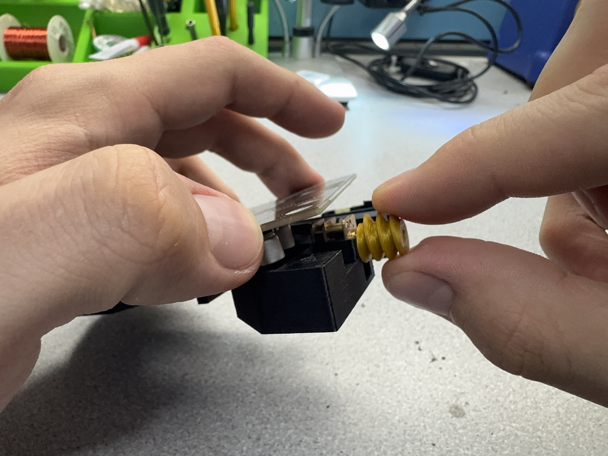
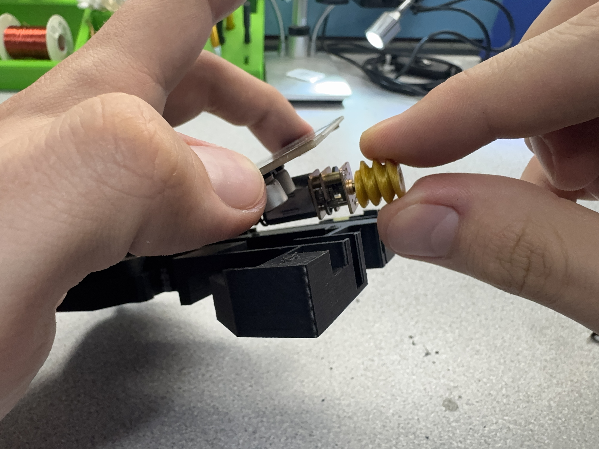
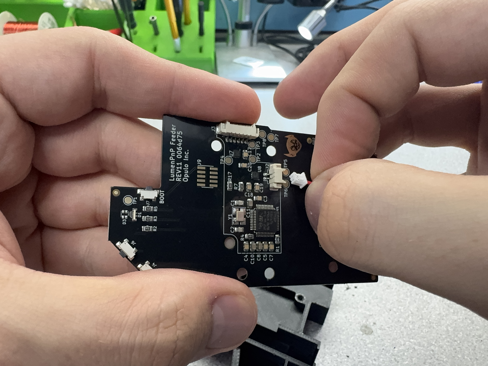

# Feeder UART Bootloader Fix

This guide is for fixing an issue in a small batch of feeders where they can't be reprogrammed using the programming dongle that came with your feeders. This issue **does not** affect the feeder's normal operation.

Our chip supplier sourced a slightly different version of the RS-485 transceiver we use with the exact same part number, just from a different lot. This lot behaves slightly differently when the DE/RE pins are left floating: the previous lot would default itself to a disabled state which allows UART programming, but the new lot has just enough leakage current to end up being enabled, which causes it to interfere with communication from the UART programmer.

There are two fixes to the issue.

!!! Note "Send to Opulo for Repair"
    If you don't mind some downtime, we'd be happy to perform the fix for you. Reach out to our [support line](https://support.opulo.io/) and we can facilitate getting your units shipped back to Opulo for repair.

## Fix #1: Firmware Update

We've developed a new version of firmware that has a workaround for this bug, and allows it to still be programmed over UART. However, it must first be programmed over SWD.

### Tools Needed

- [Black Magic Probe](https://www.adafruit.com/product/3839) SWD Programmer and Debugger
- [Pogo Pin SWD Interface](https://www.adafruit.com/product/5434) (requires the bottom of the clamp to be removed) or just some bodge wires

!!! note "J-Link"
    You can also use a [Segger J-Link](https://www.adafruit.com/product/3571) or other SWD programmer, but these instructions are for a Black Magic Probe.

### Instructions

1. Prepare your computer to flash the new firmware (MacOS and Linux).
      1. Download the `.elf` file from the most recent release of Photon [here](https://github.com/photonfirmware/photon/releases).
      2. Install `arm-none-eabi-gdb` if it is not installed already.
        1. MacOS using Homebrew: `brew install arm-none-eabi-gdb`
        2. Linux using apt: `sudo apt install arm-none-eabi-gdb`
2. Remove the version number sticker on your feeder. This sticker covers the SWD port we'll use to program the feeder.

    
    

3. Connect the Black Magic Probe to your computer, and apply the spring pin interface onto the pads on the feeder.

    

4. Flash the new `.elf` file to the feeder using:
   ```
    arm-none-eabi-gdb -nx --batch \
        --ex target extended-remote /dev/BLACK_MAGIC_PROBE_PORT \
        --ex monitor tpwr enable \
        --ex monitor swdp_scan \
        --ex attach 1 \
        --ex load \
        --ex compare-sections \
        --ex kill /path/to/firmware.elf
   ```
   after replacing `/path/to/firmware.elf` and `/dev/BLACK_MAGIC_PROBE_PORT` with the correct paths for your machine.

Your feeder now has the ability to update firmware over UART, but now enters the bootloader by holding both feeder buttons until the blue and red flashing lights stop. Check out the [feeder programming page]() to see full instructions.

## Fix #2: Interposer Board Installation (WIP)

### Tools Needed


- Soldering Iron
- Solder
- Allen key set from your LumenPnP Tool Kit
- 1x Interposer Board per feeder (request from Opulo)
- Feeder to fix

### Installation

1. Remove the lever arm screw from your feeder while holding the lever arm in place.
   
2. Carefully remove the retention arm, being mindful of the spring jumping out of its retention holes.
   
3. Remove the screws shown.
   
4. Remove the drive motor cover.
   
5. Gently lift the PCB away from the frame, and remove the Drive Motor Cable.
   
6. Gently lift the PCB away from the frame while also lifting the peel motor out of the frame by the worm gear.
   
   
7. Remove the peel motor cable from the PCB.
   
8. You should be left with the Feeder motherboard.
   
9.  The chip we'll be adding the interposer to is U6.
    
10. It will lay over U6 as shown.
    
11. Apply some solder to your iron tip, and hold the interposer as shown using tweezers.
    
12. Tack the interposer in place to pin 8 of U6 using the solder on your iron tip.
    
    
13. Solder the rest of the pins on that side of the interposer.
    
    
14. Using tweezers to help align the other side, solder the other four pads to the leads of U6.
    
    
15. Confirm the fix was effective by attempting to [program the board using the UART bootloader](../../feeders/3-software-update/#update-feeder-firmware-optional), and *not* by using the alternate method shown in red.
16. If successful, reassemble the feeder in the reverse order.
