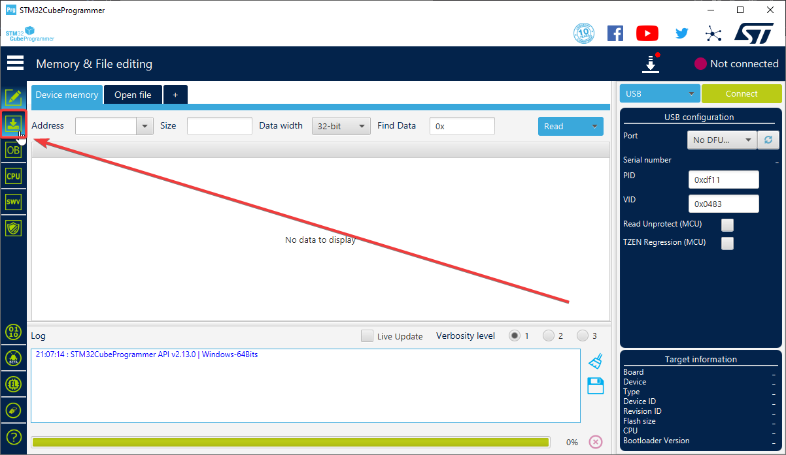
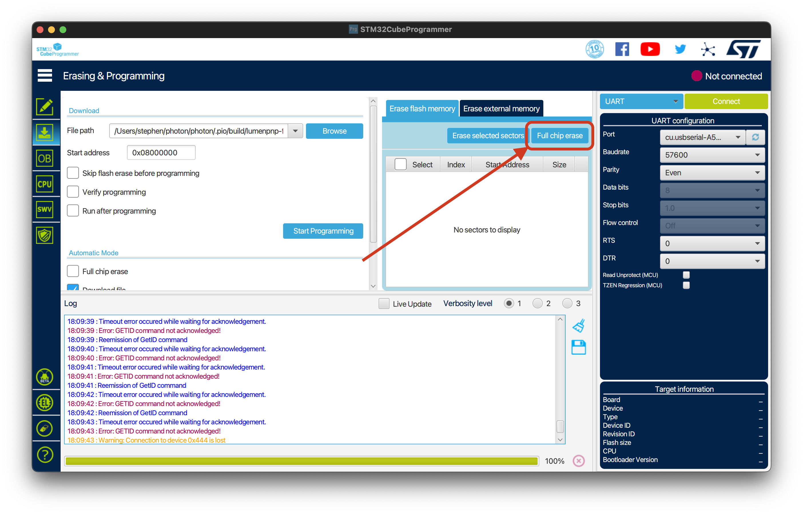
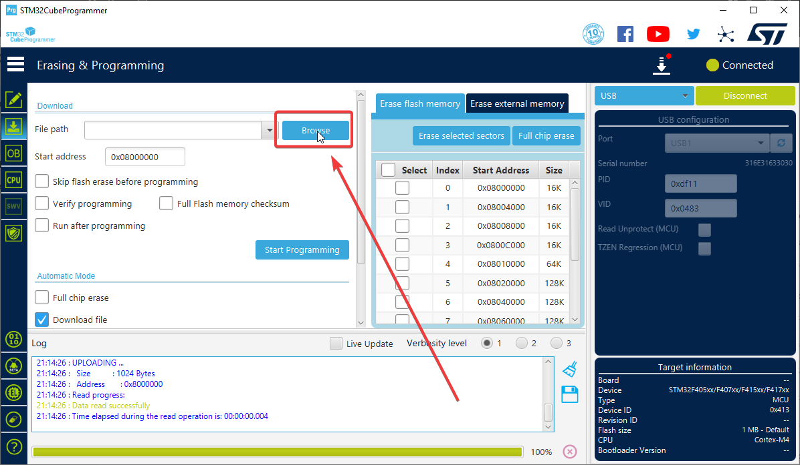
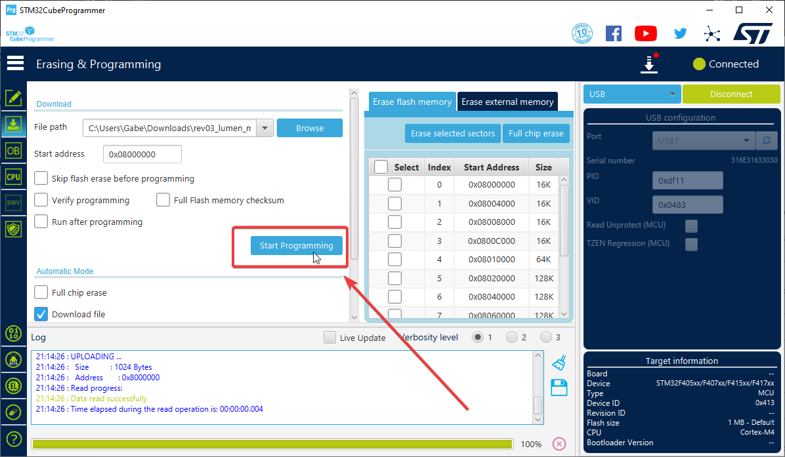
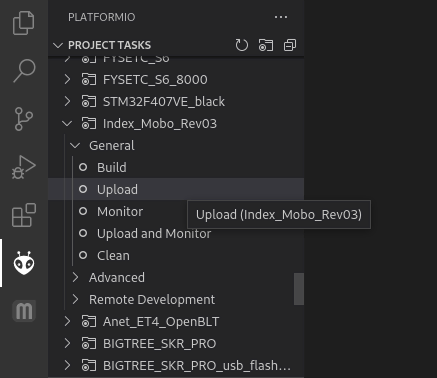
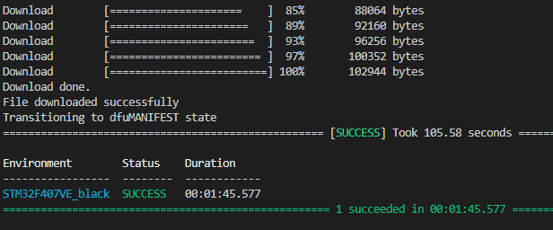
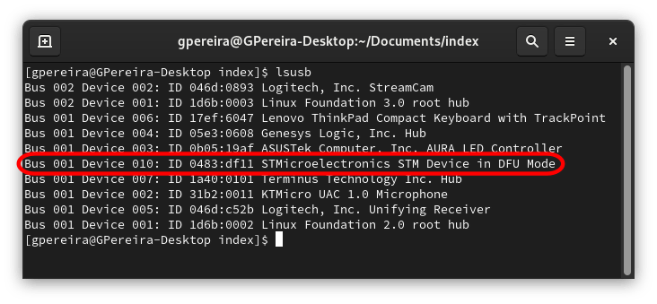

<!-- markdownlint-disable-file MD046 -->
# Update LumenPnP Firmware

All motherboards come pre-flashed with firmware from Opulo and should work out of the box without these steps. If you need to update your LumenPnP's firmware, this guide will help you do so.

Update your LumenPnP's motherboard using the [STM32CubeProgrammer](https://www.st.com/en/development-tools/stm32cubeprog.html) software by ST.

1. Download the latest [precompiled firmware](https://github.com/opulo-inc/lumenpnp/releases) `.bin` file for your motherboard version.

    !!! danger "Important"
        It is important that you pick the correct firmware file for your machine.

        - If you have a v2, choose `v2-lumenpnp-firmware-feeder-support.bin`.
        - If you have a v3.0, choose `v3.0-lumenpnp-firmware-feeder-support.bin`.
        - If you have a v3.1 or higher, choose `v3.1+-lumenpnp-firmware-feeder-support.bin`.

2. Download and install [STM32CubeProgrammer](https://www.st.com/en/development-tools/stm32cubeprog.html).
3. Open STM32CubeProgrammer.
4. Select `USB` from the connection type dropdown on the right.
    
5. Click on the download tab in the sidebar.
    

6. Attach the LumenPnP Motherboard to your computer with the included USB cable.

7. Boot your motherboard into DFU Mode
    1. Press and hold the `BOOT` button
    2. Press the `Reset` button and hold for 10 seconds
    3. Release the `Reset` button and wait for 10 seconds
    4. Release the `BOOT` button
  

    !!! info "NOTE"
        If you have a hard time getting your board to enter DFU mode, instead try unplugging both USB and the barrel jack, holding the 'BOOT' button, plugging in USB and the barrel jack, waiting 10 seconds, then releasing the `BOOT` button.

        If you're on Windows, try uninstalling STM32CubeProgrammer and reinstalling. This will also reinstall the USB drivers which can fix connection issues.

1. Click the refresh button in the `Port` line to detect the motherboard's port.
    

2. Select the newly discovered USB port from the `Port` dropdown menu.
    

3.  Double-check the other fields on the right match the image above:
    1. `PID: 0xdf11`
    2. `VID: 0x0483`
    3. `Read Unprotect (MCU): Unchecked`
    4. `TZEN Regression (MCU): Unchecked`

4.  Click the green `Connect` button to connect to the motherboard.
    

5. Delete all the flash on the chip by clicking the "Full Chip Erase" button.
    

    !!! info "This might take a while"
        Erasing all the flash on the chip takes a few minutes. Wait until you see a confirmation pop-up that the process is complete before continuing.

6.  Click the `Browse` button and select the firmware image you downloaded earlier.
    

7.  Click the `Start Programming` button to upload the firmware to the motherboard.
    

8.  Wait until the confirmation pop-up appears that the process has completed.
    

9.  Press the `reset` button on the motherboard to reboot it.

10. The machine should show up as a COM/Serial Port on your PC now, and you should be able to access it via OpenPNP. If it doesn't, press the Reset button on the board again, or power-cycle the machine *after the flashing is completed*.

## For Developers: PlatformIO

1. Download the [latest Marlin firmware][marlin] and unzip it.
2. Install [VSCode][vscode] and its [PlatformIO extension][pIO].
3. Open Marlin firmware's folder in VSCode.
4. Download the Marlin configuration files [here][marlin-config].
5. Replace the files in the `Marlin/Marlin` folder from step #1 with the new configuration files from step #4.
6. Edit the `platformio.ini` file to indicate which board you're uploading to. Update `default_envs` to read `Opulo_Lumen_REV3` or `Opulo_Lumen_REV4` depending on your motherboard.
  
7. Attach the LumenPnP Motherboard to your computer with the included USB cable (USB C to A for Motherboard 3.0, or USB B to A for Motherboard 4.0).
8. Boot your motherboard into DFU Mode
    1. Press and hold the `BOOT` button
    2. Press the `Reset` button and hold for 10 seconds
    3. Release the `Reset` button and wait for 10 seconds
    4. Release the `BOOT` button
    

    !!! info "NOTE"
        If you have a hard time getting your board to enter DFU mode, instead try powering off the machine entirely, holding the 'BOOT' button, plugging in power, waiting 10 seconds, then release the `BOOT` button.

9. Upload firmware to the board via PlatformIO:

    

    !!! Note
        You can also flash using the `dfu-util` command line utility:

        ```shell
        dfu-util -d 0x0483:0xdf11 -s 0x08000000:leave -a 0 -D ~/path/to/firmware.bin
        ```

10. Wait for the process to finish:

    

11. The machine should show up as a COM/Serial Port on your PC now, and you should be able to access it via OpenPNP. If it doesn't, press the Reset button on the board, or power-cycle the machine *after the flashing is completed*.

## Troubleshooting

If you aren't able to upload, you can check to see if your motherboard is booting into DFU mode correctly:

* Windows:

  

* Mac/Linux:

  

Also, reference [the Marlin instructions for uploading](https://marlinfw.org/docs/basics/install_platformio.html).

[abmvs]: https://marketplace.visualstudio.com/items?itemName=MarlinFirmware.auto-build
[marlin-docs]: https://marlinfw.org/docs/basics/auto_build_marlin.html
[marlin-config]: https://github.com/MarlinFirmware/Configurations/tree/import-2.1.x/config/examples/Opulo/Lumen_REV4
[marlin]: https://github.com/sphawes/Marlin/tree/feeder-safety
[vscode]: https://code.visualstudio.com/
[pIO]: https://marketplace.visualstudio.com/items?itemName=platformio.platformio-ide
