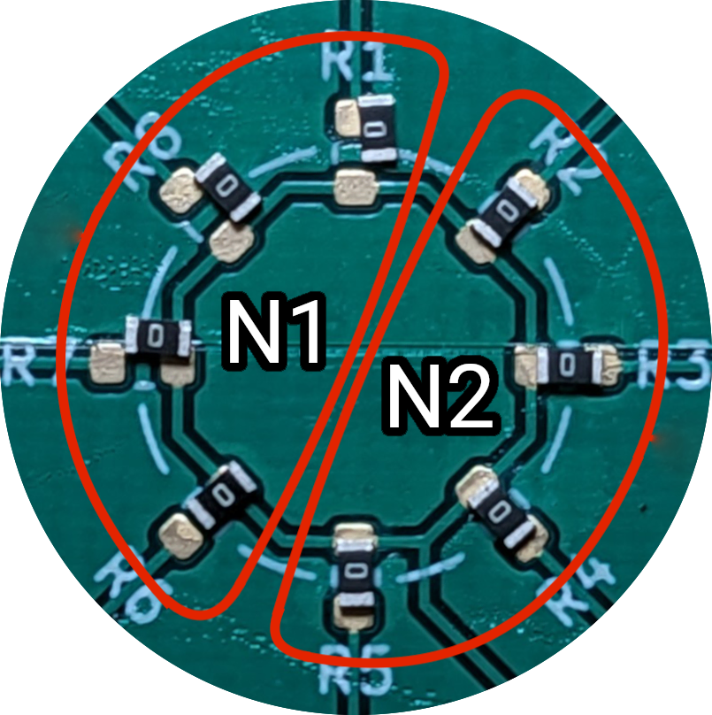

# Nozzle offset

{: style="width:60%;margin-left:10%;"}

If parts placed with a specific nozzle have a consistent offset in the X and/or Y axis, there are a couple potential root causes:

## The nozzle offset for that nozzle needs adjustment

If OpenPnP doesn't have an accurate idea of how far away a nozzle is from the top camera, it's going to place them with that inaccuracy. [Adjust that nozzle's offset](/openpnp/calibration/6-nozzle-offset).

## The bottom vision pipeline for your parts needs adjustment

OpenPnP decides how to place parts onto your board based on what it sees in the bottom camera view. If a bright light or reflective surface in view of the camera is making OpenPnP think your part is a different size than it is, you'll see a placement offset. [Adjust your part identification pipeline](/openpnp/vision-pipeline-adjustment/5).

## The nozzle's tip calibration needs adjustment

When OpenPnP performs a nozzle tip calibration, it profiles any runout in the nozzle tip. If this calibration does not correctly identify the nozzle tip, it can cause placement errors. [Adjust your nozzle tip calibration pipeline](/openpnp/vision-pipeline-adjustment/4-nozzle-calibration-pipeline/).
