# Top Camera to Nozzle Offset

Calibrating the nozzle offset ensures precise alignment between the nozzle tips and the top camera. This process involves capturing the exact position of the nozzle tip and aligning the top camera to the same reference point. The calibration is essential for accurate component placement and must be performed carefully.

This guide will calibrate both nozzles, ensuring they share the same focal plane as your datum board, components, and PCBs.

---

## Nozzle: N1 Offset (Left Toolhead)

For these steps, you should be in the `Machine Setup` tab.

!!! danger "🚨 Critical Warning: Level Nozzles 🚨"
    ⚠️ **You must ensure that your nozzles are level**.  
    **Failure to do this can cause crashes and potentially damage your machine.**  
    Use the `P` between the Z-axis up/down arrows to ensure the nozzle tips are out of the way. The `P` stands for **Parking** the nozzle out of the way into a safe height that won’t collide with any objects.  
      

1. **Select the correct nozzle to control**.
    * In the bottom left of OpenPnP, select `Nozzle: N1 - N045 (Head:H1)` from the **machine controls** dropdown. This ensures that movements and adjustments apply to the **left** nozzle equipped with the `N045` nozzle tip.  
     
  

1. **Confirm the correct nozzle tip is installed**.
    * Confirm that the `N045` nozzle tip is securely attached to **Nozzle: N1 (left toolhead)**.
  

1. **Open the Nozzle: N1 settings**.
    * Click through the following path: `Heads > ReferenceHead H1 > Nozzles > ReferenceNozzle N1`.  
     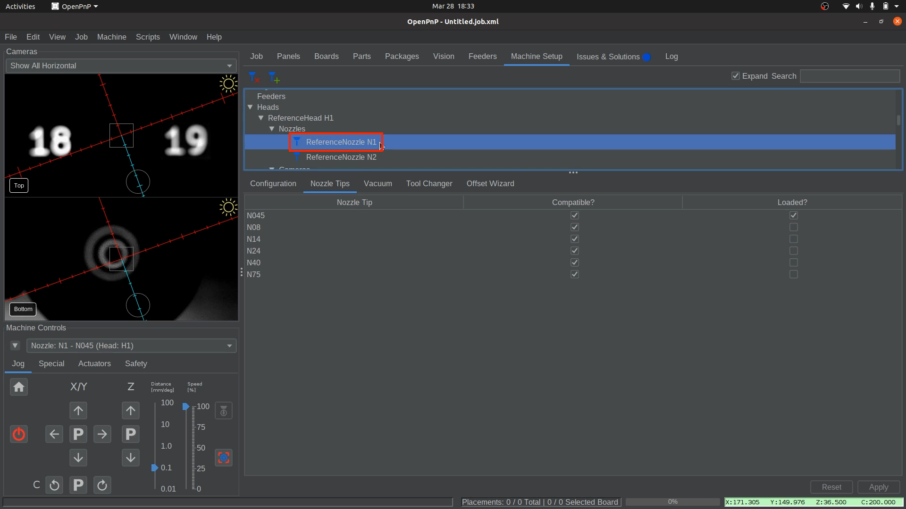
  

1. **Open the Offset Wizard tab**.
    * Navigate to the `Offset Wizard` tab, where the nozzle offset calibration process will be performed.  
     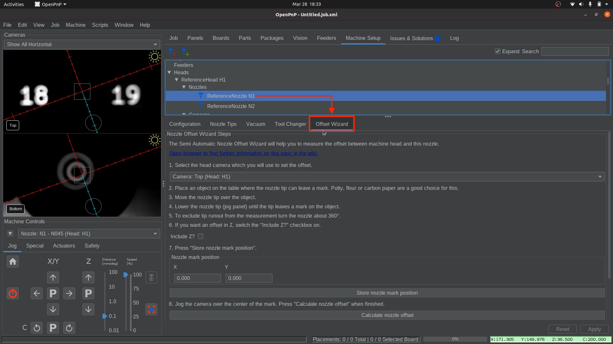
  

1. **Confirm the ‘Include Z?’ setting**.
    * Ensure that the `Include Z?` checkbox is checked. This ensures that the Z-height is properly factored into the calibration process.  
     
  

1. **Position Nozzle: N1 over the homing fiducial**.
    * Jog Nozzle: N1 (left toolhead) so that the **nozzle tip *barely* touches the datum board** and is perfectly centered over the homing fiducial. **Avoid collisions while jogging the nozzle tip**.  
    * Use the shiny edges of the fiducial that are visible around the nozzle tip to determine proper centering. Accuracy here is crucial to achieving precise placements, so please take your time with this and ensure it is dead center.  
     
  

1. **Capture Nozzle: N1’s position**.
    * Click the `Store nozzle mark position` button within the **Offset Wizard** tab to capture the Nozzle: N1's location for calibration purposes.
    * Do not navigate away from the **Offset Wizard tab** while you go through the following steps to capture the nozzle offset.  
     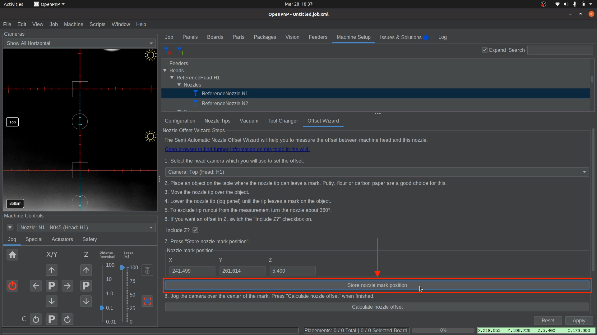
  

1. **Raise Nozzle: N1 off the datum board**.
    * Click the letter `P` between the Z up/down arrows to “**Park**” the nozzle at a safe height. This prevents collisions when moving the top camera into position.  
     

    !!! Note
        The nozzles may not be level when clicking the “**Park**” button, which is okay. The nozzle only moves to the point that it reaches the “safe zone” and then stops.
  

1. **Align the top camera over the homing fiducial**.
    * Jog the **X** and **Y** axes to bring the top camera directly over the same homing fiducial used in the previous step so it is in the exact center of the camera feed. **Do not switch away from the Offset Wizard tab**. OpenPnP **will not save** your nozzle mark position.  
     
  

1.  **Calculate the nozzle offset**.
    * Once the homing fiducial is centered in the top camera view, click `Calculate nozzle offset`. This determines the offset distance between the nozzle and the top camera based on their recorded positions.  
     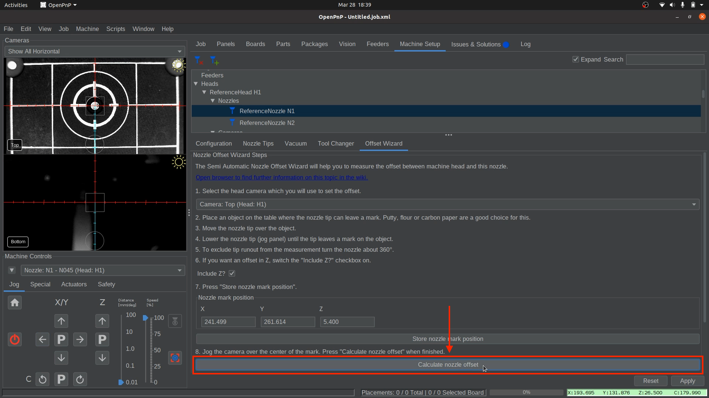
  

1. **Apply and Save Nozzle offset**.
    * Click `Apply` in the lower right corner to store the calculated offset for the left N045 nozzle tip.  
        
    * Save your OpenPnP configuration now. `File > Save Configuration`.  
        

---

## Validate Nozzle N1's Offset

Once you have completed the top camera to nozzle tip offset calibration for the first nozzle, you need to validate that the alignment is accurate before continuing to the second one. This ensures that both the camera and nozzle tips are correctly aligned with the homing fiducial before continuing with production.

Before starting, ensure you have `Nozzle N1` selected in the `Control Center`.

1. **Confirm camera alignment**
    * Go to `Machine Setup > Heads > ReferenceHead H1 > Primary Fiducial`  
        
    * Ensure the primary fiducials Z-height field is blank.
    * Click the button to bring the Top Camera to the Homing Fiducial.  
        
    * Check the camera view: the homing fiducial should appear exactly centered.
    * ❌ If it is not centered, restart the camera-to-fiducial calibration.
    * ✅ Do not continue until the fiducial is showing accurately centered in the camera feed.
  

1. **Check nozzle tip alignment**
    * Click the button to place the selected nozzle tip on the Homing Fiducial. It is directly beside the button used for the camera in step 1.  
        
    * The machine should move the nozzle tip to its calculated position.
    * Inspect the nozzle tip visually.
    * ✅ If the nozzle tip sits directly on the fiducial, no correction is needed. Proceed to calibrating Nozzle N2's offset.
    * ❌ If it is off, **note whether it is left, right, in front, or behind the homing fiducial**.
  

1. **Correct nozzle offsets**
    * When the nozzle tip does not land perfectly on the fiducial, adjust its offset.
    * You'll want to adjust the numbers after the decimal point first, to get an idea of how much you need to adjust to get it spot on. Example: The nozzle tip sits to the right of the homing fiducial. Change the fake x-value offset of -24.360 to be -24.330, which increases this value, so the nozzle will move to the left.  
      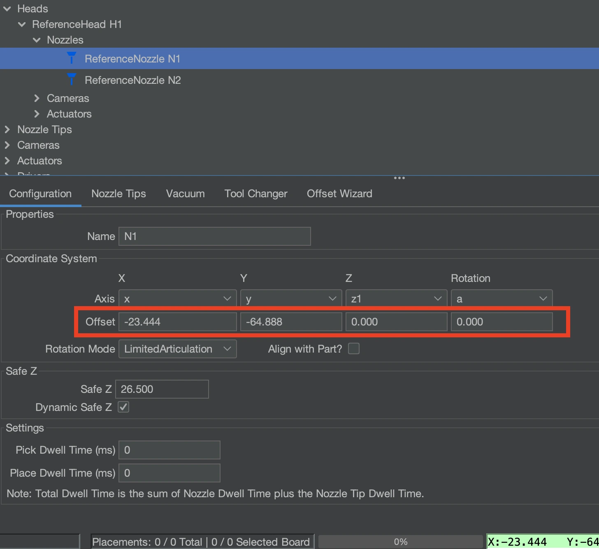  
    * Key points to remember:
      * Increasing a value will move Nozzle N1 left (X) or forward (Y)
      * Decrease a value will move Nozzle N1 right (X) or backward (Y)
    * Whether the value is positive or negative, you still “increase” or “decrease” to move in the correct direction.  

1. **Visual aid**
    * Use the table below to decide which way to change the value.
    * Red arrows represent the direction the nozzle is from the fiducial.
    * Blue arrows represent the direction the nozzle will move when that given axis value is raised or lowered.  
  
  

1. Once you've adjusted it to be accurate, Validate one last time before moving to the second nozzle.
    * Click the button to bring the Top Camera to the Homing Fiducial and confirm it is still accurate.  
        
    * Click the button to place the selected nozzle tip to our newly adjusted position on the Homing Fiducial, and confirm it is still good.  
        
    * If both are accurate, move on to calibrating the offset for Nozzle N2.

---

## Nozzle: N2 Offset (Right Toolhead)

For these steps, you should already be in the `Machine Setup` tab.

!!! danger "🚨 Critical Warning: Level Nozzles 🚨"
    ⚠️ **You must ensure that your nozzles are level**.  
    **Failure to do this can cause crashes and potentially damage your machine.**  
    Use the `P` between the Z-axis up/down arrows to ensure the nozzle tips are out of the way. The `P` stands for **Parking** the nozzle out of the way into a safe height that won’t collide with any objects.  
      

1. **Confirm the correct nozzle is installed**.
    * Confirm that the `N24` nozzle tip is still securely attached to **Nozzle: N2 (right toolhead)**.  

1. **Select the correct nozzle to control**.
    * In the bottom left of OpenPnP, select `Nozzle: N2 - N24 (Head:H2)` from the **machine controls** dropdown. This ensures that movements and adjustments apply to the **right** nozzle equipped with the `N24` nozzle tip.  
     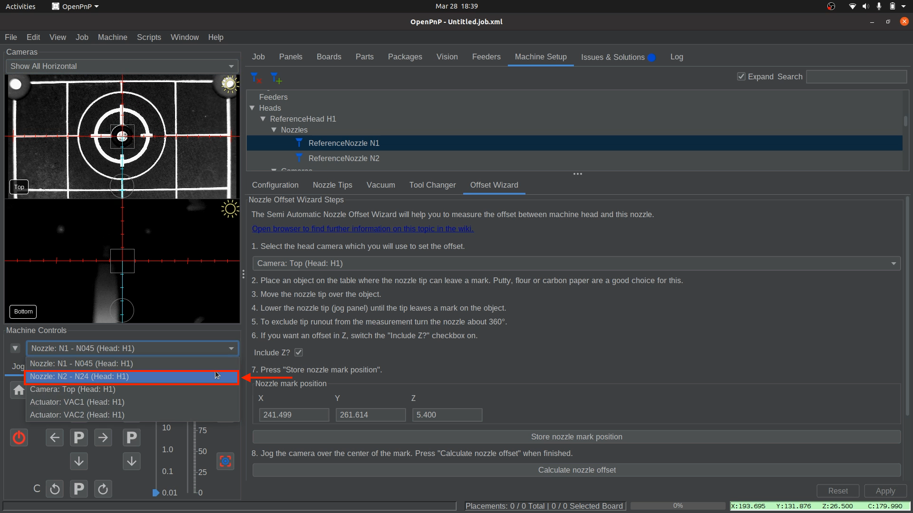
  

1. **Open the Nozzle: N2 settings**.
    * Click through the following path: `Heads > ReferenceHead H1 > Nozzles > ReferenceNozzle N2`.  
     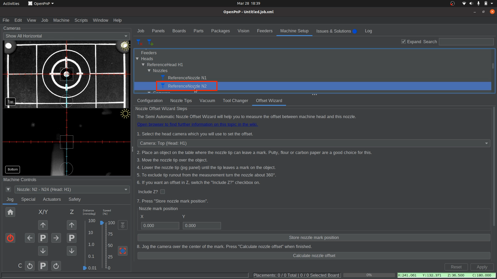
  

1. **Open the Offset Wizard tab**.
    * Navigate to the `Offset Wizard` tab if you are not already there.  
     
  

1. **Confirm the ‘Include Z?’ setting**.
    * Ensure that the `Include Z?` checkbox is checked. This ensures that the Z-height is properly factored into the calibration process.  
     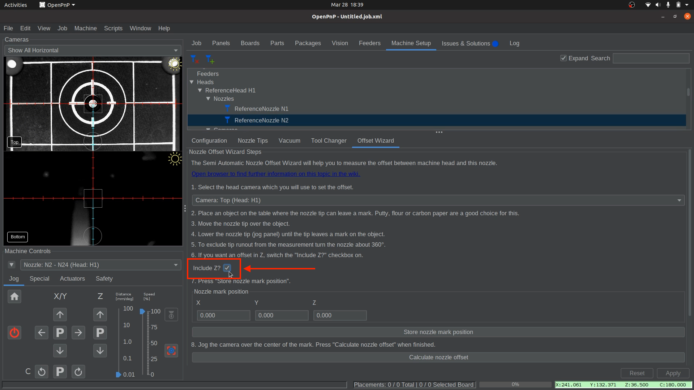
  

1. **Position the nozzle over the homing fiducial**.
    * Jog Nozzle: N2 (right toolhead) so that it is perfectly centered over the homing fiducial, while *barely* touching the datum board. **Avoid collisions while jogging the nozzle tip**.  
     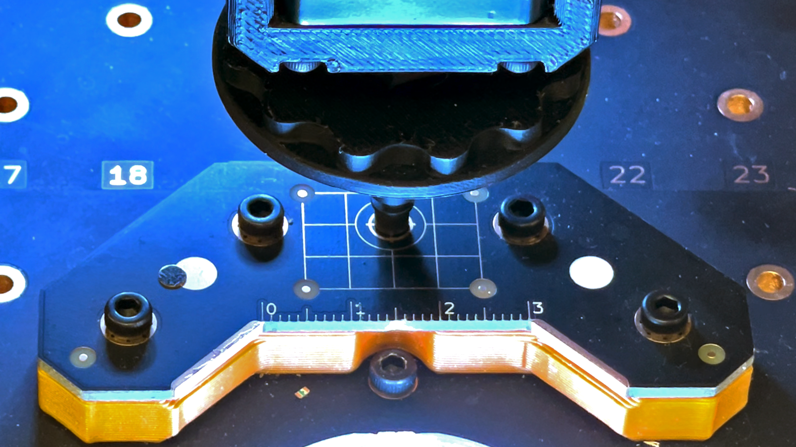  
    * This nozzle tip is larger than the last one, which is okay. We will use the circle just outside of the homing fiducial to determine if you've centered it correctly. Please take your time with this and ensure it is dead center.
  

1. **Capture the Nozzle: N2’s position**.
    * Click the `Store nozzle mark position` button within the **Offset Wizard** tab to capture Nozzle: N2's location for calibration purposes.
    * Do not navigate away from the **Offset Wizard tab** while you go through the following steps to capture the nozzle offset.  
     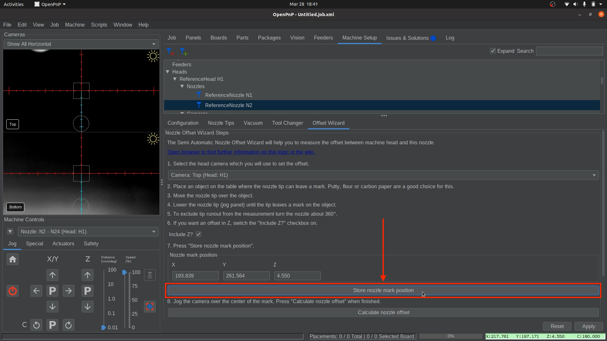
  

1. **Raise Nozzle: N2 off the datum board**.
    * Click the letter `P` between the Z up/down arrows to “**Park**” the nozzle at a safe height. This prevents collisions when moving the top camera into position.  
     

    !!! Note
        The nozzles may not be level when clicking the “Park” button, which is okay. The nozzle only moves to the point that it reaches the “safe zone” and then stops.
  

1. **Align the top camera over the homing fiducial**.
    * Jog the top camera to be directly over the homing fiducial so it is in the exact center of the camera feed. **Do not switch away from the Offset Wizard tab**. OpenPnP **will not save** your nozzle mark position if so.  
     
  

1.  **Calculate the nozzle offset**.
    * Once the homing fiducial is centered in the top camera view, click `Calculate nozzle offset`. This determines the offset distance between the nozzle and the top camera based on their recorded positions.  
     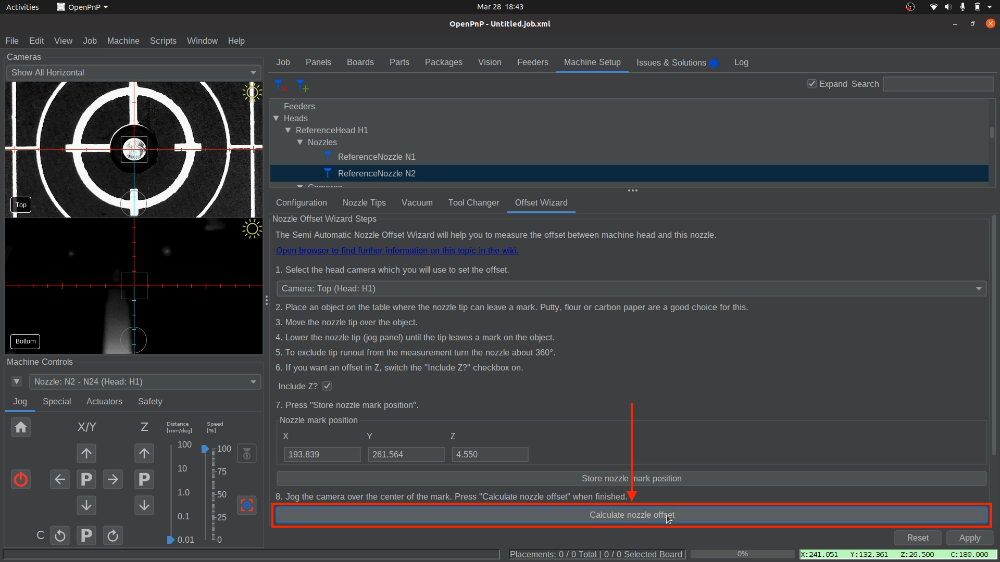
  

1. **Apply and Save Nozzle offset**.
    * Click `Apply` in the lower right corner to store the calculated offset for the right N24 nozzle tip.  
       
    * Save your OpenPnP configuration now. `File > Save Configuration`.  
        

---

## Validate Nozzle N2's Offset

Once you have completed the top camera to nozzle tip offset calibration for the second nozzle, you need to validate that the alignment is accurate before continuing to the next calibration steps. This ensures that both the camera and nozzle tips are correctly aligned with the homing fiducial before continuing with production.

**Before starting, ensure you have `Nozzle N2` selected in the `Control Center`.**

1. **Confirm camera alignment**
    * Go to `Machine Setup > Heads > ReferenceHead H1 > Primary Fiducial`  
        
    * Ensure the primary fiducials Z-height field is blank.
    * Click the button to bring the Top Camera to the Homing Fiducial.  
        
    * Check the camera view: the homing fiducial should appear exactly centered.
    * ❌ If it is not centered, restart the camera-to-fiducial calibration.
    * ✅ Do not continue until the fiducial is showing accurately centered in the camera feed.
  

1. **Check nozzle tip alignment**
    * Click the button to place the selected nozzle tip on the Homing Fiducial. It is directly beside the button used for the camera in step 1.  
        
    * The machine should move the nozzle tip to its calculated position.
    * Inspect the nozzle tip visually.
    * ✅ If the nozzle tip sits directly on the fiducial, no correction is needed, and both your nozzle tips are validated. Proceed to the next section.
    * ❌ If it is off, **note whether it is left, right, in front, or behind the homing fiducial**.
  

1. **Correct nozzle offsets**
    * When the nozzle tip does not land perfectly on the fiducial, adjust its offset.
    * You'll want to adjust the numbers after the decimal point first, to get an idea of how much you need to adjust to get it spot on. Example: Change the fake x-value offset of 23.350 to be 23.380, which increases this value, so the nozzle will move to the left.  
      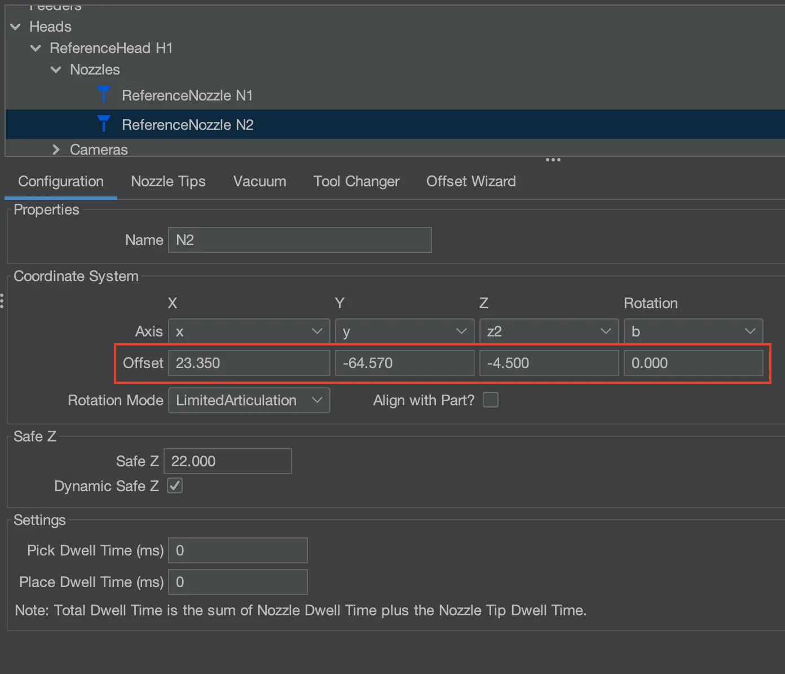  
    * Key points to remember:
      * Increasing a value will move Nozzle N2 left (X) or forward (Y)
      * Decrease a value will move Nozzle N2 right (X) or backward (Y)
    * Whether the value is positive or negative, you still “increase” or “decrease” to move in the correct direction.  

1. **Visual aid**
    * Use the table below to decide which way to change the value.
    * Red arrows represent the direction the nozzle is from the fiducial.
    * Blue arrows represent the direction the nozzle will move when that given axis value is raised or lowered.  
  
  

1. Once you've adjusted it to be accurate, Validate one last time before moving on.
    * Click the button to bring the Top Camera to the Homing Fiducial and confirm it is still accurate.  
        
    * Click the button to place the selected nozzle tip to our newly adjusted position on the Homing Fiducial, and confirm it is still good.  
        
    * If both are accurate, move on to calibrating the bottom camera position, which is in the next steps.

---

## Next Steps

Next is [Bottom Camera Position](../7-bottom-camera-position/index.md).