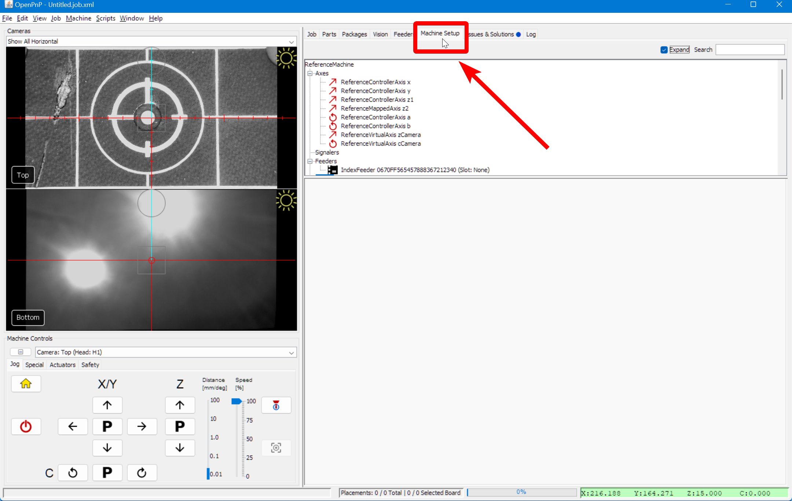
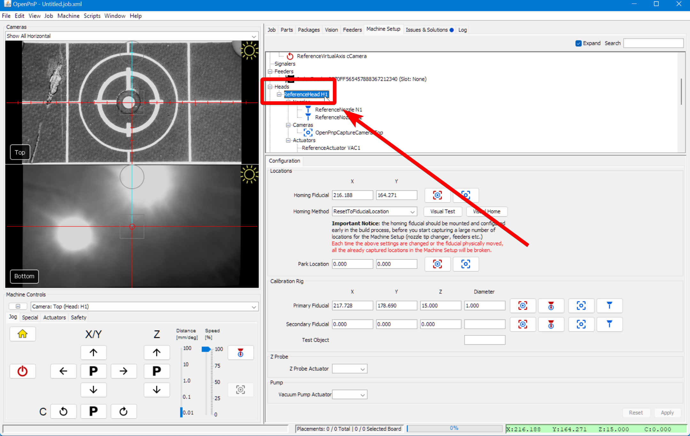
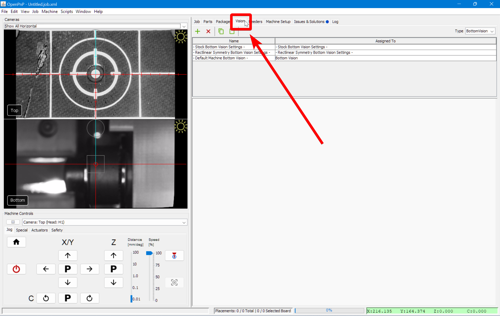
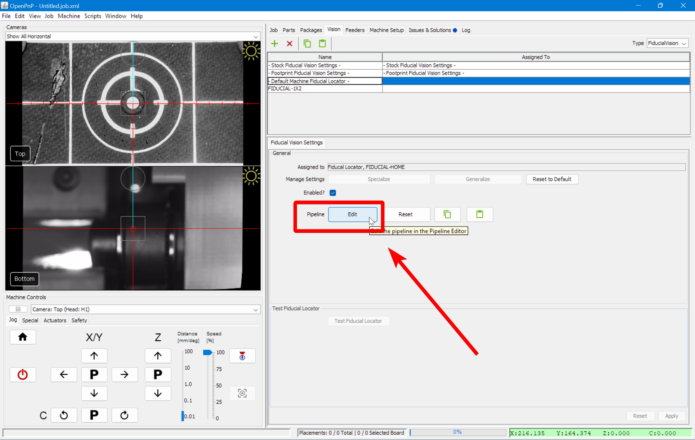
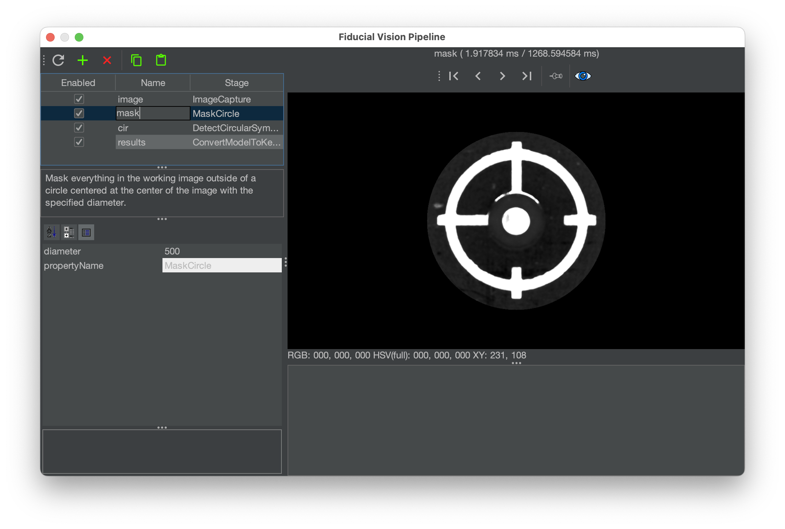
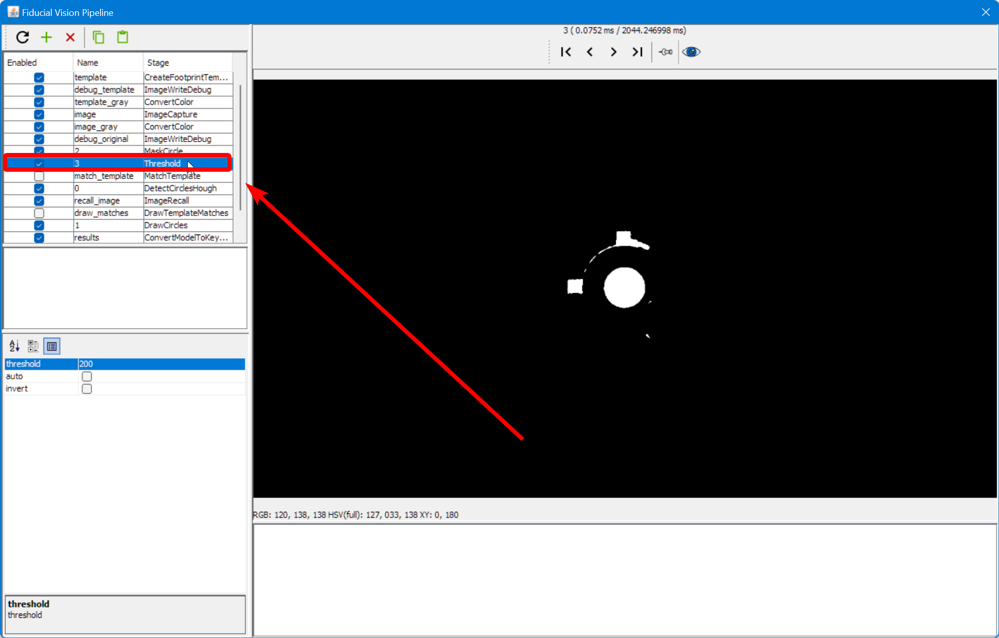
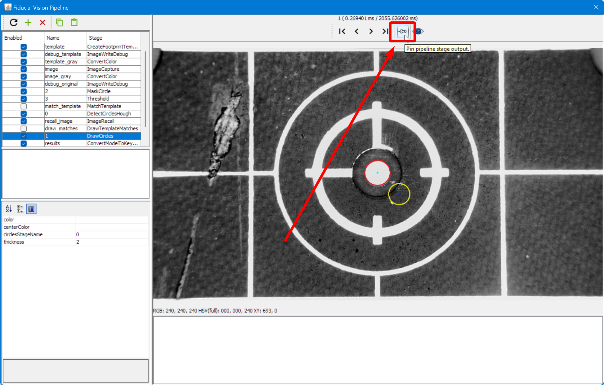
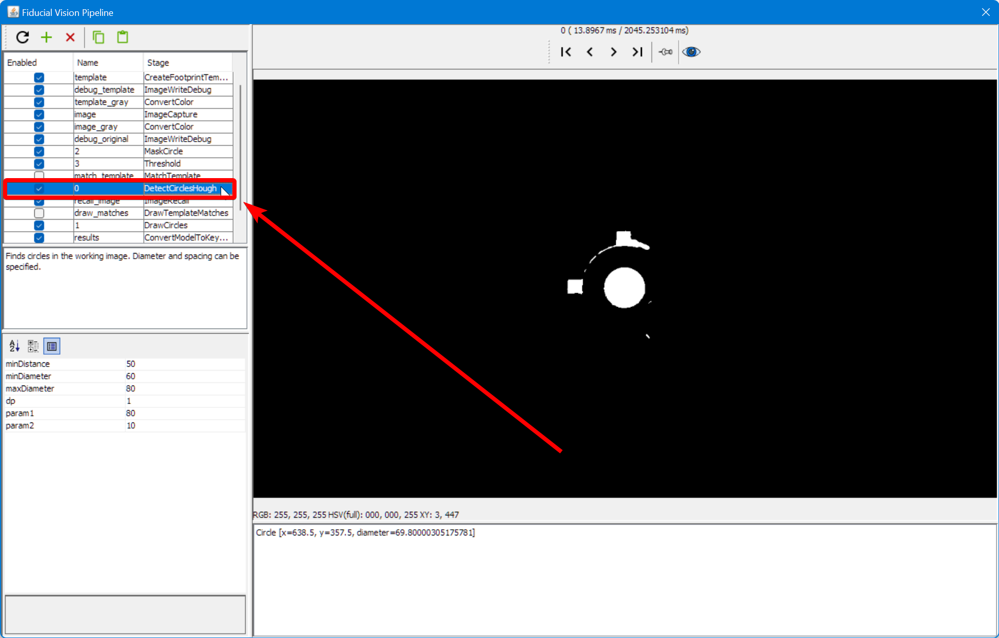
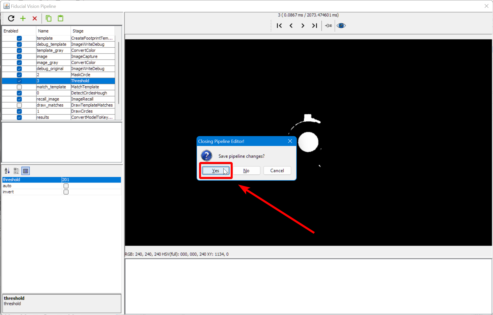

# Homing Fiducial Pipeline ([Video Guide](https://youtu.be/RVMS6vJzJyU?si=-dzIkANilr8o8j56&t=18))

If you receive the error message `FIDUCIAL-HOME no matches found` when homing your LumenPnP, you likely need to adjust your homing vision pipeline. Follow the steps below for a guide on the iterative approach.

  

## Open the Pipeline

1. Click on the `Machine Setup` tab in the top right pane.

    

2. Click on the "Expand" checkbox if necessary.

    

3. Click on `Heads > ReferenceHead H1`.

    

4. Click on the "Position Camera over location" icon button show below. This will move the top camera to the location where your datum board is mounted.

    

5. Verify that your top camera is positioned exactly over the homing fiducial.

    

6. Adjust the exposure of your camera image as described in the [Homing Fiducial Section](../calibration/4-homing-fiducial/index.md#double-check-camera-exposure).

7. Navigate to the `Vision` tab.

    

8. Select on `FiducialVision` from the type dropdown.

    

9. Choose `- Default Machine Fiducial Locator -` from the pipeline list.

    

10. Click `Edit` to open the **Pipeline Editor**.

    

## Edit the pipeline

This window allows you to modify the vision pipeline for detecting the homing fiducial. Detection is now based on circular symmetry, replacing the older threshold-based circle detection method. Both methods are included here for reference, but we strongly recommend using circular symmetry.

### Circular symmetry method

!!! warning "Check your pipeline version"

      If your vision pipeline does not match the image below, you are using the older method. Update your pipeline by following these steps.

      

      1. Click the "Copy" button in the code block below to save the vision pipeline to your clipboard.

        ```xml
        <cv-pipeline>
            <stages>
                <cv-stage class="org.openpnp.vision.pipeline.stages.ImageCapture" name="image" enabled="true" default-light="true" settle-first="true" count="1"/>
                <cv-stage class="org.openpnp.vision.pipeline.stages.MaskCircle" name="mask" enabled="true" diameter="500" property-name="MaskCircle"/>
                <cv-stage class="org.openpnp.vision.pipeline.stages.DetectCircularSymmetry" name="cir" enabled="true" min-diameter="10" max-diameter="150" max-distance="250" search-width="0" search-height="0" max-target-count="1" min-symmetry="1.2" corr-symmetry="0.0" property-name="" outer-margin="0.2" inner-margin="0.4" sub-sampling="8" super-sampling="1" diagnostics="true" heat-map="true"/>
                <cv-stage class="org.openpnp.vision.pipeline.stages.ConvertModelToKeyPoints" name="results" enabled="true" model-stage-name="cir"/>
            </stages>
        </cv-pipeline>
        ```

      1. Click the `Clipboard` icon in the vision pipeline window to insert the new pipeline into OpenPnP.

          

1. Check the output of the `mask` stage. This stage blacks out unnecessary parts of the image to reduce false detections. This reduces the chance that the pipeline will find a different circle in the image and detect it as the homing fiducial. Click on this stage to view and adjust its `diameter` settings.

    * A diameter too large could allow other potential circles into the image and could be erroneously detected by the pipeline. A diameter too small could potentially mask out the actual homing fiducial.

    

2. Check the output of the `cir` stage of the pipeline. This stage looks for circular symmetry in the image, and outputs a colored heatmap showing where it thinks the center of circular symmetry is. The goal is to have this stage put the brightest, most yellow point of the heatmap in the center of the homing fiducial. Click on this stage to view its settings.

    1. If OpenPnP detects circular symmetry, you will see a line similar to: `Circle [x=639.5, y=361.5, diameter=78.0, score=133.06040353848752]` in the field in the bottom right of the window. This means OpenPnP found circular symmetry, and it tells you about the circle that it found.
    

    2. If no circles are detected, adjust the max diameter circle so that it can find larger ones. Increasing the value for `maxDiameter` will tell the stage to accept circles of a larger diameter.

!!! warning "Legacy - Circle Deteection Method (Outdated)"
    If your pipeline looks like this, we recommend you switch to the [circle symmetry method](#circular-symmetry-method).

    1. Select the `DrawCircles` stage.
     

    2. The main view will show a detected circle if OpenPnP has identified the homing fiducial.
        1. If **multiple circles** are detected, or one detected circle is not correctly drawn around the homing fiducial, refine the filtering until the real homing fiducial is properly detected.
        2. If **no circle appears**, we need to adjust the detection setting to make the real homing fiducial easier to identify.
        3. If the image looks like the reference image, your pipeline is properly tuned. 

### Adjust Pipeline

1. Click on the `Threshold` stage
  

2. Adjust the `threshold` parameter as necessary until the image is precise.
    1. If the image is too dark, Increase the `threshold` setting.
    2. If the image is too bright, decrease the `threshold` setting.

3. Select the `DrawCircles` stage and verify the fiducial has been correctly identified.
  

4. If not, pin the `DrawCircles` stage view.
  

5. Select the `DetectCirclesHough` stage.
  

6. Adjust the `param2` parameter as necessary until the correct number of circles are identified.
    1. If no circles are detected, lower the `param2` setting.
    2. If too many circles are detected, raise the `param2` setting.

#### Review Pipeline Output

1. Once the fiducial is correctly detected, close the pipeline editor.
  

1. **Save the changes when prompted**.
  

1. Attempt to `home` the LumenPnP to see if it can identify the homing fiducial.
  

1. If you receive the same `FIDUCIAL-HOME no matches found` error, you'll need to keep tuning your pipeline. Go back to [checking the debug results](#check-the-debug-results).
  
